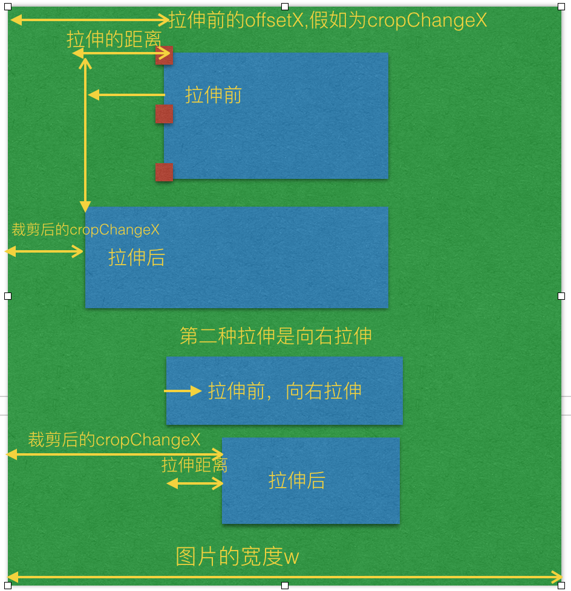

**一：裁剪的思路：**

**1-1，裁剪区域：**
需要进行裁剪首先需要形成裁剪区域，裁剪区域的大小和我们的鼠标移动的距离相关联，鼠标移动有多远，裁剪区域就有多大。如下图：


**1-2 裁剪区域的宽和高的计算：**

如上图，鼠标的横向移动距离和纵向移动距离就形成了裁剪区域的宽和高。那么裁剪区域的宽和高的计算是：当我们点下鼠标时，就能够通过event事件
对象获取鼠标点击位置，e.clientX 和 e.clientY; 当鼠标进行移动的时候，也能通过event获取鼠标的位置，通过两次鼠标位置的改变，就能够获得
鼠标移动的距离。即：初始的x轴位置为 initX = e.clientX, initY = e.clientY;
移动到某个点的位置为：endX = e.clientX, endY = e.clientY;
因此裁剪区域的宽 Tx = endX - initX;
裁剪区域的高是 Ty = endY - initY;

**1-3 阴影区域的形成**

被我们裁剪图片中除了裁剪区域以外的部分，都属于阴影部分。如下图所示：


那么阴影区域要如何计算呢？比如左阴影宽，左阴影宽 = 裁剪区域的左偏移值 - 图片本身的左偏移值；那么上阴影高 =
裁剪区域的上偏移值 - 图片上偏移值, 如下图所示：


那么下阴影的高度 = 图片本身的高度 - 上阴影的高度 - 裁剪区域的高度；那么右阴影的宽度 = 图片的宽度 - 左阴影宽 - 裁剪区域的宽。

**1-4 理解裁剪区域被越界**

裁剪图片过程中会出现越界的情况，那么越界又需要分为2种情况，**第一种是：裁剪过程中的越界，第二种是 移动裁剪区域的越界。**

**1-4-1 裁剪越界**
什么是裁剪时越界？ 就是当我们使用鼠标拖动区域裁剪超出了图片的宽度和高度，形成了的越界；如下图所示：


对于这种越界需要判断被裁剪区域的右侧相对于浏览器左侧的位置，不能超过图片右侧的位置相对于浏览器左侧的位置；
且 被裁剪区域的底部相对于浏览器顶部的位置 不能超过 图片的底部相对于浏览器顶部的位置，如下图所示：


**1-4-2 移动越界**
移动越界指已经形成了裁剪区域了，但是我们可以通过鼠标裁剪区域时产生了越界。其实判断原理和裁剪越界的原理一样的。

**2. 图片如何进行压缩？**

当图片的宽度大于容器的宽度，就需要进行压缩；因此 var scale = 容器的宽度 / 图片的宽度；
如果图片的高度 * 缩放比例 > 容器的高度，那么缩放比例 scale = 容器的高度 / 图片的高度；否则的话，不进行压缩。
**2-1：对于压缩后 translate3d中的X轴和Y轴移动位置计算方式：**

x = 容器的宽度 / 压缩比
y = 容器的高度 / 压缩比
即：transform: translate3d(x, y, z) -> translate3d(容器的宽度 / 压缩比 + 'px', 容器的高度 / 压缩比 + 'px', 0)

因此页面布局变成如下：

[](javascript:void(0);)

```
<!DOCTYPE html>
<html>
<head>
  <title>图片裁剪</title>
  <meta charset="utf-8">
  <meta name="viewport" content="width=device-width,initial-scale=1.0,maximum-scale=1.0,user-scalable=0">
  <link rel="stylesheet" type="text/css" href="./index.css">
</head>
<body>
  <div id="app" style="height:500px;margin: 0 auto;">
    <div class="vue-cropper">
      <div class="cropper-box">
        <div class="cropper-box-canvas" style="width:644px;height:642px;transform: scale(0.778816, 0.778816) translate3d(453.252px, -87.312px, 0px) rotateZ(0deg)">
          
        </div>
      </div>
      <div class="cropper-drag-box cropper-crop"></div>
    </div>
  </div>
</body>
</html>
```

[](javascript:void(0);)

**4. 裁剪的过程中，如何计算裁剪的宽度和高度？**

当我们点下鼠标时，就能够通过event事件对象获取鼠标点击位置，e.clientX 和 e.clientY; 当鼠标进行移动的时候，也能通过event获取鼠标的位置，
通过两次鼠标位置的改变，就能够获得鼠标移动的距离。即：
初始的x轴和Y轴位置分别为 cropX = e.clientX, cropY = e.clientY;
移动后现在的X轴和Y轴的位置分别为：nowX = e.clientX, nowY = e.clientY;
因此裁剪区域的临时值 var fw = ~~(nowX - cropX);
裁剪区域的临时值是 fh = ~~(nowY - cropY);

裁剪图片的时候，有可能往右拖动(值会越来越大)，也有可能往相反的方向(向左)拖动(值会越来越小)，同理，向上或向下拖动也是同一个道理。因此需要判断
fw 和 fh是否大于0的判断；在鼠标按键下去的时候，先获取鼠标相对于事件源元素的X和Y轴坐标，e.offsetX 和 e.offsetY;
因此 cropChangeX = e.offsetX; cropChangeY = e.offsetY;
对于offsetX 和 offsetY 的理解如下；


if (fw > 0) {
var cropW(裁剪区域的实际宽度) = cropChangeX + fw > w(图片的实际宽度) ? w - cropChangeX : fw;
cropOffsertX = cropChangeX;
}
cropOffsertX 就是保存事件源相对于元素的距离。


如果fw 小于0，说明是往左裁剪，那么裁剪的距离 fw = (事件结束的clientX - 事件的开始clientX);
如果 (图片的实际宽度 - e.offsetX) + Math.abs(fw) > 图片的实际宽度 ? this.cropChangeX : Math.abs(fw);
即：

if (fw < 0) {
var cropW(裁剪区域的实际宽度) = (w - cropChangeX) + Math.abs(fw) > w ? cropChangeX : Math.abs(fw);
cropOffsertX = cropChangeX + fw > 0 ? cropChangeX + fw : 0;
}
说明往左裁剪的最大宽度只能是 e.offsetX; 不能超过该值，否则的话，就会越界。
此时cropOffsertX偏移值改变了； cropOffsertX = cropChangeX + fw > 0 ? cropChangeX + fw : 0; 如图下所示：


上面分析的是 宽和高不固定比例的裁剪，下面我们来看下 宽和高固定比例的裁剪。

**5. 宽和高固定比例裁剪计算；**

比如宽和高比是 3:4 这样的截图；fixedNumber = [3, 4]

因此 固定比例高度的计算
fixedHeight 裁剪区域的实际宽度
------------- = ---------------
fixedNumber[1]     fixedNumber[0]

因此：
var fixedHeight = ~~(裁剪区域的实际宽度 / fixedNumber[0] * fixedNumber[1]);

如果固定比例的移动的高度 + Y轴上相对于图片的偏移值 > 大于图片的高度的话，那么裁剪区域的高度(cropH) = 图片的高度(h) -
Y轴上相对于图片的偏移值(cropOffsertY); 如下图所示：


获取到了 裁剪区域的高度的话，就可以获取到裁剪区域的宽度了；计算方式是：
cropW(裁剪区域的宽度) = ~~(cropH / fixedNumber[1] * fixedNumber[0]);
同时也要判断fw 是否大于0，来计算 cropOffsertX 的值；

if (fw > 0) {
var cropOffsertX = cropChangeX
} else {
var cropOffsertX = cropChangeX - cropW
}

fw > 0 说明是往右移动，因此 cropOffsertX = cropChangeX;
fw < 0 说明是往左移动，cropOffsertX = 初始的 e.offsetX - 裁剪区域的宽度
即：

[](javascript:void(0);)

```
if (fixedHeight + cropOffsertY > h) { 
  cropH(裁剪区域的高度) = h - cropOffsertY;
  cropW(裁剪区域的宽度) = ~~(cropH / fixedNumber[1] * fixedNumber[0]);
  if (fw > 0) {
    var cropOffsertX = cropChangeX
  } else {
    var cropOffsertX = cropChangeX - cropW
  }
} else {
  // 否则 
  cropH = fixedHeight;
}
```

[](javascript:void(0);)

**6. 理解裁剪区域拉伸原理**

控制裁剪区域拉伸的点，共有12种可以拉伸的点，分别有裁剪区域的四根线可以拉伸，有四根线上的八个点可以拉伸；如下图所示：


当鼠标点击拉伸的时候，会触发mousedown事件；因此需要区分下到底是那根线或那个点向什么方向拉伸。因此定义 canChangeX 和
canChangeY 两个变量，
判断是否能改变X轴和Y轴；默认是false；同时定义两个变量为 changeCropTypeX 和 changeCropTypeY，含义是能否改变x轴或Y轴的基准点。默认为1；可以改变。

**1. 裁剪区域的最上面的线； 可以上下拉伸, 不能左右拉伸；**
因此可以约定： canChangeX = false, canChangeY = true; changeCropTypeX = 0; changeCropTypeY = 1;

**2. 裁剪区域左边的线；可以左右拉伸，不能上下拉伸；**

因此可以约定：canChangeX = true, canChangeY = false; changeCropTypeX = 1; changeCropTypeY = 0;

**3. 裁剪区域底部线; 可以上下拉伸，不能左右拉伸；**

因此可以约定：canChangeX = false; canChangeY = true; changeCropTypeX = 0; changeCropTypeY = 2;(
为了区分上面的线，因此等于2)；

**4. 裁剪区域右边线；可以左右拉伸，不能上下拉伸；**

因此可以约定：canChangeX = true; canChangeY = false; changeCropTypeX = 2;（为了区分左边的线） changeCropTypeY = 0;

**5. 左上角的点；可以向上或向左移动；**

因此 canChangeX = true, canChangeY = true; changeCropTypeX = 1; changeCropTypeY = 1;

**6. 上面中间的点，只能上下拉伸，不能左右拉伸；**

因此 canChangeX = false, canChangeY = true; changeCropTypeX = 0; changeCropTypeY = 1;

**7. 右上角的点，可以左右拉伸和上下拉伸；**

因此 canChangeX = true, canChangeY = true; changeCropTypeX = 2; changeCropTypeY = 1;

**8. 左中角的点，只能左右拉伸，不能上下拉伸；**

因此 canChangeX = true, canChangeY = false; changeCropTypeX = 1; changeCropTypeY = 0;

**9. 右中角的点，只能左右拉伸，不能上下拉伸；**

因此 canChangeX = true, canChangeY = false; changeCropTypeX = 2; changeCropTypeY = 0;

**10. 左下角的点，可以向上或向左移动；**

因此 canChangeX = true, canChangeY = true; changeCropTypeX = 1; changeCropTypeY = 2;

**11. 下线中间的店，可以上下拉伸，不能左右拉伸；**

因此 canChangeX = false, canChangeY = true; changeCropTypeX = 0; changeCropTypeY = 2;

**12. 下右角点，可以上下拉伸，左右拉伸；**

因此 canChangeX = true, canChangeY = true; changeCropTypeX = 2; changeCropTypeY = 2;

下面来看看移动操作；
var fw = ~~(移动结束的clientX - 初始的clientX);
var fh = ~~(移动结束的clientY - 初始的clientY);

**6-1 向左或向右拉伸的基本原理：**

[](javascript:void(0);)

```
if (canChangeX) {
  // 如果x轴能改变的话，说明是 裁剪区域中左右两根线或是左右两个线上的点了。
  if (changeCropTypeX === 1) {
    // 如果x轴的基点能改变的话，并且等于1，说明是裁剪区域左边的线或左边线上的点了。
    // 那就有四种可能值，1. 左边的线，2. 左上角的点，3. 左中角的点。 4. 左下角的点。

  } else if (changeCropTypeX === 2) {
    // 同理，说明是裁剪区域右边的线或右边线上的点了。
    // 那也有四种可能值，1. 右边的线，2. 右上角的点，3. 右中角的点。4. 右下角的点。
  }
}
```

[](javascript:void(0);)

**changeCropTypeX === 1 的情况**；继续如下判断：

假设裁剪区域的原始宽度为 cropOldW，裁剪区域的原始高度为 cropOldY， cropChangeX 保存原始的裁剪区域相对于图片的e.offsetX；

[](javascript:void(0);)

```
if (cropOldW - fw > 0) {
  如果裁剪区域的原始宽度 大于 移动的距离的话，那么说明两点，第一是向左拉伸的话，fw为负数，第二是向右拉伸，但是拉伸的距离小于裁剪区域的原始宽度
  裁剪区域后的宽度 = 图片的宽度 - 拉伸前的offsetX - 拉伸的距离 <= 图片的宽度的话 ? 拉伸前的offsetX(cropChangeX) - 拉伸的距离   : 裁剪区原始宽度 + 拉伸前的offsetX.
  裁剪后的 cropOffsertX = 图片的宽度 - 拉伸前的offsetX(cropChangeX) - 拉伸的距离 <= 图片的宽度的话 ?   裁剪区域前的offsertX（cropChangeX） + 拉伸的距离 : 0;
}
```

[](javascript:void(0);)

不管向左拉还是向右拉，裁剪区后的宽度 都等于 = 拉伸前的offsetX(cropChangeX) - 拉伸的距离;
裁剪后的 cropOffsertX = 裁剪区域前的offsertX(cropChangeX) + 拉伸的距离; 如下图所示：



[](javascript:void(0);)

```
if (cropOldW - fw <= 0) {
  裁剪拉伸后的宽度 = 拉伸后的距离fw + cropChangeX <= 图片的宽度 ? 拉伸后的距离fw - 拉伸前的裁剪区域的宽度 :     图片的宽度 - 拉伸前的裁剪区域的宽度 - cropChangeX;
  裁剪拉伸后的 cropOffsertX = 拉伸前的裁剪区域的offsetX(cropChangeX) + 裁剪区域之前的宽度;
}
```

[](javascript:void(0);)

如下图所示：


**changeCropTypeX === 2 的情况；**

说明是裁剪区域右边的线或右边线上的点拉伸了。那也有四种可能值，1. 右边的线，2. 右上角的点，3. 右中角的点。4. 右下角的点。

同理；右边的线拉伸也有向左拉伸和向右拉伸，如果向左拉伸的话，那么fw肯定为负数，如果向右拉伸的话，那么fw就为正数。

if (cropOldW + fw > 0) {
// 如果原始的裁剪区域的宽度 + 拉伸的距离大于0，说明是向右拉伸或者向左拉伸，但是向左拉伸的距离小于原始裁剪区域
if (裁剪区域的原始宽度 + 移动距离fw + cropOffsertX <= 图片的宽度的话) {

}
这里的 **裁剪区域的原始宽度 + 移动距离fw + cropOffsertX <= 图片的宽度的话** 也有两种情况，第一种是向左拉伸，第二种是向右拉伸，但是没有拉伸到底，
也就是说拉伸的距离没有到图片的最右边;

**现在的图片裁剪区域宽度(cropW) = 图片的原始区域的宽度 + fw(拉伸的距离，向左拉伸或向右拉伸);**

否则的话，也就是说拉伸到最右边了，那么 **图片裁剪区域宽度(cropW) = 图片的宽度 - 裁剪区域拉伸前的cropOffsertX;**

因此此时 **cropOffsertX = 拉伸前的裁剪区域的offsetX(cropChangeX);**
}

如下图所示：


```
if (cropOldW + fw <=0) {
   // 如果原始裁剪区域的宽度 + 拉伸的距离小于或等于0的话，说明是向左拉伸，并且拉伸的距离正好大于或等于裁剪区域原始的宽度；
}
```

这边向左拉伸的距离又可以分为2种情况，第一种是 向左拉伸的距离 小于 (原始裁剪区域 + 拉伸前的offsetX); 第二种就是向左拉伸的时候越界了，

那么让拉伸后的宽度还控制在 offsetX的宽度即可，即不越界；因此如下逻辑判断:

**现在图片裁剪区域的宽度(cropW) = (图片的宽度w - 拉伸前的offsetX + Math.abs(拉伸的总距离 + 裁剪前的原始距离)) <=
图片的宽度w ？ Math.abs(拉伸的总距离 + 裁剪前的原始距离) : 拉伸前的offsetX;**

此时的 **cropOffsertX = (图片的宽度w - 拉伸前的offsetX + Math.abs(拉伸的总距离 + 裁剪前的原始距离)) <= 图片的宽度w
？拉伸前的offsetX - Math.abs(拉伸的总距离 + 裁剪前的原始距离) : 0;**

**如下图所示：**

****

**6-2 向上或向下拉伸的基本原理**

[](javascript:void(0);)

```
if (canChangeY) {
  // 如果Y轴能改变的话，说明是 裁剪区域中上下两根线或是上下两个线上的点了。
  if (this.changeCropTypeY === 1) {

    // 如果Y轴的基点能改变的话，并且等于1，说明是裁剪区域上边的线或上边线上的点了。
    // 那就有四种可能值，1. 上边的线，2. 上左角的点，3. 上中角的点。 4. 上右角的点。

  } else if(this.changeCropTypeY === 2) {
    // 等于2，说明是裁剪区域下边的线或下边线上的点了。
    // 同理也就有四种可能值，1. 下边的线，2. 下左角的点，3. 下中角的点。 4. 下右角的点。
  }
}
```

[](javascript:void(0);)

**changeCropTypeY === 1 的情况；**

假设裁剪区域的原始宽度为 cropOldH，裁剪区域的原始高度为 cropOldY， cropChangeY 保存原始的裁剪区域相对于图片的e.offsetY，
向上或向下拉伸的距离为fh.

如果是向下拉伸的话，又分为2种情况，第一种是向下拉伸它的距离不超过原始裁剪区域的高度 cropOldH, 第二种是已经超过它的原始裁剪区域的高度了。

**if (原始裁剪区域的高度cropOldH - 拉伸的距离fh > 0) {**
// 说明是向上拉伸(fw肯定为负数)或向下拉伸(fw肯定为正数)，但是向下拉伸的距离不超过原裁剪区域的高度
裁剪区域后的高度cropH 计算又分为2种情况，第一种是向上拉伸的距离fh小于或等于拉伸前的 e.offsetY, 第二种拉伸距离是大于e.offsetY，也就是向上
拉伸的时候越界了, 如果越界了，那么拉伸后的高度 = 裁剪之前的原始高度 + e.offsetY(裁剪区域之前的offsetY)；因此：

**裁剪区域后的高度cropH = 图片的高度 - e.offsetY(裁剪区域之前的offsetY) - fh <= 图片的高度 ? 图片的原始高度cropOldH -
拉伸的距离fh :**
**裁剪之前的原始高度 + e.offsetY(裁剪区域之前的offsetY);**

**拉伸区域之后的cropOffsertY = 图片的高度 - e.offsetY(裁剪区域之前的offsetY) - fh <= 图片的高度 ? e.offsetY(
裁剪区域之前的offsetY) + fh : 0**
}

如下图所示：


**if (原始裁剪区域的高度cropOldH - 拉伸的距离fh <= 0) {**
// 说明是向下拉伸，且拉伸的距离fh大于或等于原始裁剪区域的高度cropOldH
同时一样也要判断两种情况，第一种是向下拉伸后，没有超过图片的最低端，第二种是超过了图片的最低端，也就是越界的情况。

**拉伸后裁剪区域的高度 = 拉伸后的总距离fh + 拉伸前的offsetY <= 图片的高度h ? 拉伸后的总距离fh -
裁剪区域原始的高度cropOldH : 图片的高度H -**
**拉伸前的offsetY - 裁剪区域原始的高度 cropOldH;**

**拉伸区域之后的cropOffsetY = 拉伸前的offsetY + 裁剪区域原始的高度cropOldH;**
}

如下图所示：


**changeCropTypeY === 2 的情况**

等于2，说明是裁剪区域下边的线或下边线上的点了。

**if (原裁剪区域的高度 + 被拉伸的距离fh > 0) {**
// 说明了有可能是向下拉伸，或向上拉伸，但是向上拉伸的距离小于原裁剪区域的高度
**裁剪区域后的高度 = 原裁剪区域的高度 + 被拉伸的距离fh + 原始裁剪区域的offsetY <= 图片的高度 ? 原裁剪区域的高度 +
被拉伸的距离fh : 图片的高度 -**
**原始裁剪的offsetY**

**裁剪后的cropOffsertY = 原始裁剪的offsetY;**
}

如下图所示：


**if (原裁剪区域的高度 + 被拉伸的距离fh <= 0) {**
// 说明是向上拉伸，且向上拉伸的距离大于或等于原始裁剪区域的高度
**裁剪区域后的高度 = 图片的高度 - 原裁剪区域的offsetY + Math.abs(fh + 原裁剪区域的高度) <= 图片的高度 ?
原裁剪区域的高度 + 被拉伸的总距离fh :**
**原裁剪区域的offsetY;**

**裁剪后的offsetY = 图片的高度 - 原裁剪区域的offsetY + Math.abs(fh + 原裁剪区域的高度) <= 图片的高度 ?
原裁剪区域的offsetY - Math.abs(被拉伸的总距 离fh + 原裁剪区域的高度) : 0;**
}

如下图所示：


**6-3: 向左或向右拉伸且是固定比例拉伸**，假设固定比例 3:4, 即 fixedNumber = [3, 4];
向左或向右拉伸，高度会随着变化。如下图所示：


if (canChangeX && fixed) {

比如宽和高比是 3:4 这样的比例；fixedNumber = [3, 4]
因此 固定比例高度的计算

**裁剪区域的高度 fixedNumber[1]**
**------------- = ---------------**
**裁剪区域的宽度 fixedNumber[0]**

因此：
var 裁剪区域的高度(fixedHeight) = ~~(裁剪区域的宽度 / fixedNumber[0] * fixedNumber[1]);
**if (裁剪区域的高度 + 原裁剪区域的offsetY > 图片的高度) {**
// 说明向左拉伸或向右拉伸，导致纵向区域越界了，
**拉伸后的高度 = 图片的高度 - 原裁剪区域的offsetY;**

**拉伸后的宽度 3**
**---------- = ----**
**拉伸后的高度 4**

**拉伸后的宽度 = 拉伸后的高度 / fixedNumber[1] \* fixedNumber[0];**
} else {
**拉伸后的高度 = fixedHeight;**
}
}

同样的道理，如果Y轴上的上下线拉伸的话，宽度会跟着变化，也是一样的计算方式：

**if (this.canChangeY && this.fixed) {**
比如宽和高比是 3:4 这样的比例；fixedNumber = [3, 4];
因此 固定比例宽度的计算

**裁剪区域的高度 fixedNumber[1]**
**------------- = ---------------**
**裁剪区域的宽度 fixedNumber[0]**

**裁剪区域的宽度(fixedWidth) = ~~(裁剪区域的高度 / fixedNumber[1] \* fixedNumber[0]);**
if (裁剪区域的宽度 + 原裁剪区域的offsetX > 图片的宽度) {
// 说明向上或向下拉伸，横向区域越界了
拉伸后的宽度 = 图片的宽度 - 原裁剪区的offsetX;

​    **拉伸后的宽度 3**
​    **---------- = ----**
​     **拉伸后的高度 4**

**拉伸后的高度 = 拉伸后的宽度 / fixedNumber[0] \* fixedNumber[1];**
} else {
**拉伸后的宽度 = fixedWidth;**
}
}

**7. 截图移动操作**

首先可以先获取原裁剪区域的offsetx，和 offsetY, 该offsetX和offsetY是相对于浏览器的，因此原坐标的x轴和Y轴的 e.clientx 和
e.clientY;
当鼠标移动裁剪区到一个新坐标的时候，会有一个新的 e.clientX 和 e.clientY; 把终点的x轴和Y轴离客户端的距离 - 起点的x轴和Y轴的距离，
就等于移动了多少的距离了，再加上原裁剪区相对于浏览器的 offsetX 或 offsetY后，就是最终相对于浏览器的坐标了；因此；
**fw = 终点的x轴坐标(e.clientX) - 起点的x轴坐标(e.clientX) + 原裁剪区相对于浏览器的x轴坐标(offsetX);**
**fh = 终点的y轴坐标(e.clientY) - 起点的y轴坐标(e.clientY) + 原裁剪区相对于浏览器的y轴坐标(offsetY);**

**如下图所示：**


**if (移动后的距离fw小于或等于1的话) {**
**移动后的cropOffsertX = 1;**
**} else if ((移动后的距离 + 裁剪区域的宽度) > 图片的宽度的话) {**
**// 说明移动的裁剪区域越界了，那么就让裁剪区处于中间的位置**
**移动后的cropOffsertX = 图片的宽度 - 裁剪区的宽度 - 1;**
**}**

**如下图所示：**

****

else {
**移动后的cropOffsertX = fw;**
}

**同理 if (移动后的距离fh小于或等于1的话) {**
**移动后的cropOffsertY = 1;**
**} else if ((移动后的距离 + 裁剪区域的高度) > 图片的高度的话) {**
**// 说明移动的裁剪区域越界了，那么就让裁剪区处于中间的位置**
**移动后的cropOffsertY = 图片的高度 - 裁剪区的高度 - 1;**
**} else {**
**移动后的cropOffsertY = fh;**
**}**

**8. 自动截图操作**

代码的基本原理是：看组件是否传递了 autoCropWidth 和 autoCropHeight, 如果传递了该参数的宽度和高度的话，那么使用该参数的值，
如果没有传递的话，或者说该宽度和高度的值都为0的话，那么截取的宽度和高度就是图片的宽度和高度的80%；如果传递的宽度w和高度h大于图片的
本身的宽度或高度的话，那么宽度或高度的值就是图片的本身的宽度和高度的值。
如果传递了固定比例的话，那么高度的计算是根据宽度的比例来计算出来的。计算方式还是之前一样的：如下：

```
       w              fixedNumber[0]
  -------------   =  ---------------
       h              fixedNumber[1]
```

因此 h = w / this.fixedNumber[0] * this.fixedNumber[1]

如果高度大于图片的高度的话，那么高度就是等于图片的高度，然后根据现在的高度重新计算宽度；
代码如下：
// 如果比例之后 高度大于h
if (h > this.h) {
h = this.h
w = h / this.fixedNumber[1] * this.fixedNumber[0]
}

自动截图的主要代码如下：

[](javascript:void(0);)

```
var w = this.autoCropWidth
var h = this.autoCropHeight
if (w === 0 || h === 0) {
  w = this.w * 0.8
  h = this.h * 0.8
}
w = w > this.w ? this.w : w
h = h > this.h ? this.h : h
if (this.fixed) {
  h = w / this.fixedNumber[0] * this.fixedNumber[1]
}
// 如果比例之后 高度大于h
if (h > this.h) {
  h = this.h
  w = h / this.fixedNumber[1] * this.fixedNumber[0]
}
```

[](javascript:void(0);)

[github的源码--PC端](https://github.com/tugenhua0707/vue-cropper-demo)